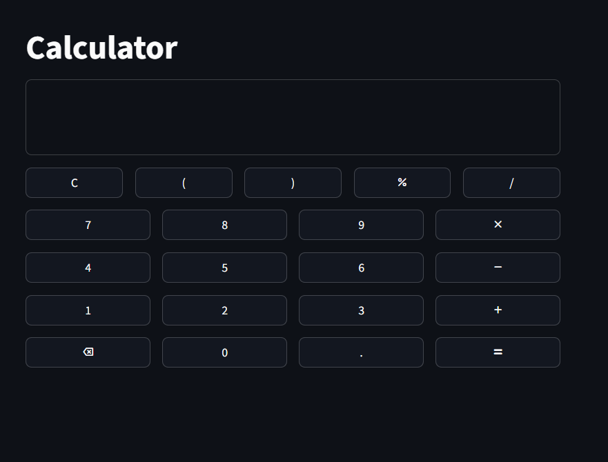

# 🧮 Simple Calculator

A simple and clean calculator app built with **python** and **Streamlit**
Easily run locally or using Docker.

---

## 🚀 Installation

### 1️⃣ Clone the Repository
```bash
git clone https://github.com/dattu095/calculator.git
cd calculator
```

### 2️⃣ Install Dependencies
```bash
pip install -r requirements.txt
```

### 3️⃣ Run the App
```bash
streamlit run src/main.py
```

Go to 👉 **http://localhost:8501** in your browser to access the app.

---

## 🐳 Docker Setup

### Build Docker Image
```bash
docker build -t todo .
```

### Run Docker Container
```bash
docker run -p 8501:8501 todo:latest
```

Visit 👉 **http://localhost:8501** to use the app.

---

## 📌 Features
- ➕ Add new tasks with **title**, **priority**, and **due date**  
- ✅ Mark tasks as completed or pending  
- 🗑 Delete tasks  
- 📅 See days remaining until the due date  
- 🎨 Simple, clean, and responsive UI

---

## ⚙️ Tech Stack
- **Python 3.12+**
- **Streamlit** – Web UI framework
- **Docker** – Containerization
- **Eval** - For evaluating expressions safely

---

## 📱 Usage
### 🏠 Main Screen
When you open the app, you’ll see:
- A display area to show input and results
- A calculator keypad with digits, operators, and special keys

From here, you can:
- 🔢 Enter numbers and operators using the keypad
- ✅ Press = to evaluate the expression
- 🧹 Use C to clear all input
- ⬅️ Use backspace to delete the last character

Screenshot:


---
